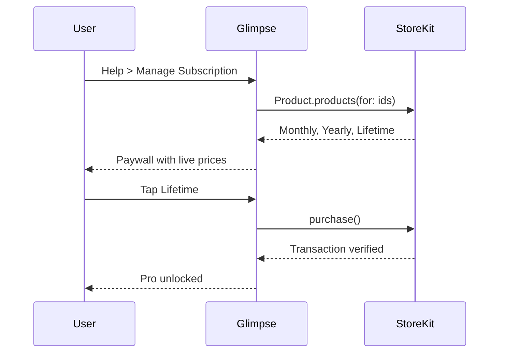
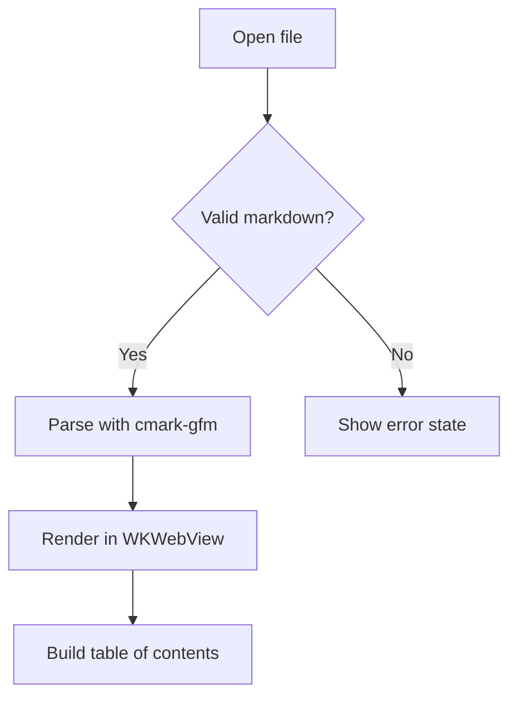

# Glimpse Feature Tour

This file exercises every rendering feature Glimpse supports. Open it to verify
formatting, syntax highlighting, tables, math, and diagrams in one pass.

## Text formatting

**Bold**, *italic*, ***bold italic***, ~~strikethrough~~, `inline code`, and
[external links](https://aduman.github.io/glimpse-support/).

Line breaks, soft wraps, and paragraphs behave as GitHub Flavored Markdown specifies.

### Lists

- Unordered item
- Another item
  - Nested one level
    - Nested two levels
- Back to top level

1. Ordered item
2. Second item
   1. Nested ordered
   2. Sibling
3. Third item

- [x] Completed task
- [x] Another completed task
- [ ] Outstanding task

### Blockquotes

> A single-level quote.
>
> > A nested quote inside it.
>
> Back to one level.

## Code blocks

```swift
import SwiftUI

@main
struct GlimpseApp: App {
    @State private var state = AppState()

    var body: some Scene {
        WindowGroup {
            ContentView(state: state)
        }
        .commands { GlimpseCommands() }
    }
}
```

```javascript
const render = (markdown) =>
  markdown
    .split("\n\n")
    .map((block) => `<p>${block}</p>`)
    .join("");
```

```sql
SELECT product_id, COUNT(*) AS purchases
FROM transactions
WHERE created_at >= NOW() - INTERVAL '30 days'
GROUP BY product_id
ORDER BY purchases DESC;
```

```
Plain fenced block with no language set.
No highlighting is applied here.
```

## Tables

| Language | Extension | Highlighted |
|---|---|:---:|
| Swift | `.swift` | Yes |
| Python | `.py` | Yes |
| JavaScript | `.js` | Yes |
| Rust | `.rs` | Yes |
| Plain text | `.txt` | No |

Alignment variants:

| Left | Center | Right |
|:---|:---:|---:|
| a | b | c |
| longer cell | centered | 1,234.56 |

## Math

Inline: the mass-energy equivalence $E = mc^2$ and Euler's identity
$e^{i\pi} + 1 = 0$.

Display:

$$
\frac{\partial}{\partial t}\Psi(x,t) = \frac{i\hbar}{2m}\nabla^2\Psi(x,t)
$$

$$
\sum_{k=1}^{n} k = \frac{n(n+1)}{2}
$$

## Diagrams





## Horizontal rules

---

Content between rules.

---

## Links and images

Reference-style [link to the support site][support], and an inline
[link to the privacy policy](https://aduman.github.io/glimpse-support/privacy/).

[support]: https://aduman.github.io/glimpse-support/support/

## Long content

Presentation mode treats each top-level heading as a slide, so this document
also works as a deck. Press Cmd+Shift+P to try it.

Export the rendered result with Cmd+E (PDF) or Cmd+Shift+E (HTML).
