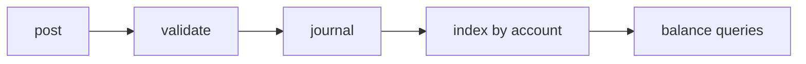

# Ledger

A small double-entry bookkeeping library with no dependencies.

[](https://example.com)
[](https://example.com)

## Install

```bash
npm install @example/ledger
```

Or with Yarn:

```bash
yarn add @example/ledger
```

## Quick start

```javascript
import { Ledger, Account } from "@example/ledger";

const ledger = new Ledger({ currency: "USD" });

const cash = ledger.account("Assets:Cash");
const revenue = ledger.account("Income:Sales");

ledger.post({
  date: "2026-07-26",
  memo: "Invoice #1042",
  entries: [
    { account: cash, debit: 2500.0 },
    { account: revenue, credit: 2500.0 },
  ],
});

console.log(ledger.balance(cash)); // 2500.00
```

## Why double entry

Every transaction touches at least two accounts and the sum of debits must equal
the sum of credits. That invariant is checked on every post, so the books cannot
silently drift out of balance.

| Concept | Meaning |
|---|---|
| Debit | Increases assets and expenses |
| Credit | Increases liabilities, equity, and income |
| Journal | Ordered list of transactions |
| Ledger | Transactions grouped by account |

## API

### `new Ledger(options)`

| Option | Type | Default | Description |
|---|---|---|---|
| `currency` | `string` | `"USD"` | ISO 4217 currency code |
| `precision` | `number` | `2` | Decimal places retained |
| `strict` | `boolean` | `true` | Throw when a posting is unbalanced |

### `ledger.post(transaction)`

Records a transaction. Throws `UnbalancedError` when debits and credits differ
and `strict` is enabled.

### `ledger.balance(account, asOf?)`

Returns the account balance, optionally as of a date.

## Architecture



## Contributing

1. Fork the repository
2. Create a feature branch: `git checkout -b feature/my-change`
3. Run the test suite: `npm test`
4. Open a pull request

- [x] Tests pass
- [x] Types exported
- [ ] Changelog entry added

## License

MIT. See `LICENSE` for details.
