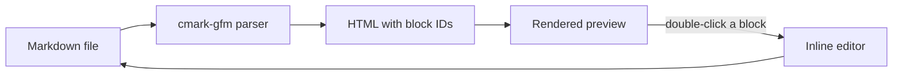

# Welcome to Glimpse

A native macOS markdown viewer. This document is a live sample: everything below is
rendered by Glimpse right now, so you can see every feature without hunting for a file
to open.

> Tip: press **Cmd+K** to jump between files, **Cmd+F** to search this document, and
> **Cmd+Shift+P** to present it as a slideshow.

---

## Formatting

Markdown basics render exactly as you would expect: **bold**, *italic*,
~~strikethrough~~, `inline code`, and [links](https://aduman.github.io/glimpse-support/).

- Nested lists work
  - to any depth
    - like this
- With ordered siblings:

1. First step
2. Second step
3. Third step

Task lists are supported too:

- [x] Render GitHub Flavored Markdown
- [x] Syntax highlighting
- [ ] Your next document

## Code

Fenced code blocks are highlighted by language.

```swift
struct Glimpse: App {
    var body: some Scene {
        WindowGroup {
            ContentView()
        }
    }
}
```

```python
def word_count(path: str) -> int:
    with open(path) as f:
        return len(f.read().split())
```

```bash
brew install pandoc && pandoc README.md -o README.pdf
```

## Tables

| Feature | Free | Pro |
|---|:---:|:---:|
| Rendered preview | Yes | Yes |
| Table of contents | Yes | Yes |
| Syntax highlighting | Yes | Yes |
| Presentation mode | No | Yes |
| PDF and HTML export | No | Yes |
| Inline block editing | No | Yes |
| Apple Intelligence tools | No | Yes |

## Math

Inline math like $E = mc^2$ renders alongside display equations:

$$
\int_{-\infty}^{\infty} e^{-x^2}\,dx = \sqrt{\pi}
$$

## Diagrams



## Quotes and rules

> Markdown is intended to be as easy-to-read and easy-to-write as is feasible.
>
> Readability, however, is emphasized above all else.

---

## Try these

Double-click any paragraph in this document to edit it inline. The change is written
straight back to the file and re-rendered.

| Action | Shortcut |
|---|---|
| Quick Open | Cmd+K |
| Find in document | Cmd+F |
| Export PDF | Cmd+E |
| Export HTML | Cmd+Shift+E |
| Zen Mode | Cmd+Shift+F |
| Presentation Mode | Cmd+Shift+P |
| Keyboard shortcuts | Cmd+/ |

## About Pro

Viewing markdown in Glimpse is free, with no time limit and no account. Pro adds
presentation mode, PDF and HTML export, inline block editing, extra themes, and the
Apple Intelligence tools on macOS 26 and later.

New installs begin a 14-day Pro trial automatically, so every feature above is unlocked
right now. To see the plans at any time, choose **Help > Manage Subscription** from the
menu bar, or open **Settings (Cmd+,) > General > Upgrade**.

Questions or bug reports: <https://aduman.github.io/glimpse-support/support/>
